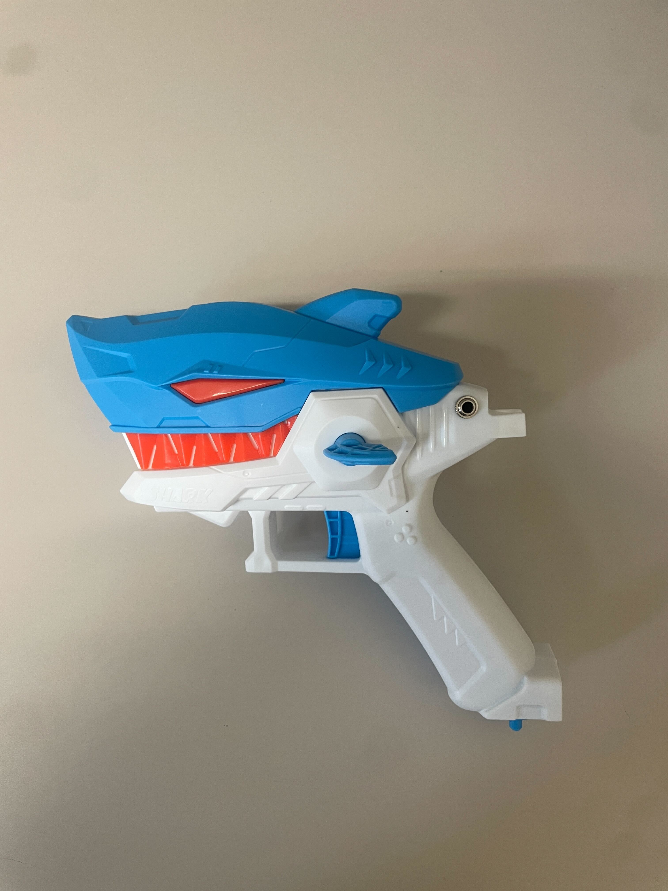

<!--- Open Source Assistive Technology: GitHub Readme Template Version 1.2 (2024-May-27)  --->

<!--- INSTRUCTIONS --->
<!--- This is a markdown template for creating the README.md file in a GitHub repository. This file is rendered and displayed automatically when someone visits the repository.

This document includes helper text that will not be displayed when rendered. Any text between the less-than sign + exclamation mark + three hyphen-minus (<!---) and matching three hyphen-minus + greater-than sign will not be displayed. This helper text can be deleted once the corresponding section is completed.

This template has a number of fields that can be searched and replaced with other text:
 - <Device_Name> Replace this with filename-friendly version of the device with underscores. e.g., Open_Wobble_Switch
 - <DeviceName> Replace this with the human-readable name of the device with spaces. e.g., Open Wobble Switch
 - <DesignerName> Replace this with the person or organization responsible for the design. e.g., John Doe.
 - <Repository_Link> Replace this with the web address for the repository. e.g., (e.g., https://github.com/makersmakingchange/Open-Wobble-Switch))
 - <MMCWebLink> This is the website address including an alphanumeric id for the Makers Making Change Website. e.g., 01tJR000000698oYAA. This will come from MMC staff.  
 - <MaterialCost> Replace this with the dollar cost and currency (CAD, USD, etc.) of the materials of the device.
 - <ShippingCost> Replace this with the dollar cost and currency (CAD, USD, etc.) of shipping the device (if possible).
 - <YEAR> year(s) of the copyright
 
Any text that is currently holding a space / is an instruction for the person filling in the README is in all capitals, to make it easier to see them in a rendered version.

--->
 
<!--- TITLE --->
# Fabulous Sharknado
<!--- Should match the name of the GitHub repository. Choose something descriptive rather than whimsical.  --->

## Overview
<!--- A brief summary of the project. What it does, who it is for, how much it costs. --->
The Switch Adapted Water Gun is an assistive technology device that is compatible with a 3.5mm switch. 

The device is comprised of off-the-shelf and 3D printed parts. 

The Switch Adapted Water Gun is open assistive technology (OpenAT). Under the terms of the open source licenses, the device may be built, used, and improved upon by anyone.

The overall cost of materials is about $15.

## How to Obtain the Device
### Do-it-Yourself (DIY) or Do-it-Together (DIT)

This is an open-source assistive technology, so anyone is free to build it. All of the files and instructions required to build the device are contained within this repository. Refer to the Maker Guide below.

## Build Instructions
<!--- Outline the major steps required to create a build --->

### 1. Order the Off-The-Shelf Components

The [Bill of Materials](/Documentation/Switch_Adapted_Water_Gun_BOM.xlsx) lists all of the parts and components required to build the device.

### 2. Print the 3D Printable components

All of the files and individual print files can be found in the [/Build_Files/3D_Printing_Files](/Build_Files/3D_Printing_Files) folder.

### 3. Assemble the <DeviceName>

Reference the Assembly Guide section of the [Maker Guide](/Documentation/Switch_Adapted_Water_Gun_Assembly_Document.pdf) for the tools and steps required to build the device.

## How to improve this Device
As open source assistive technology, you are welcomed and encouraged to improve upon the design. 

## Files
### Documentation
<!--- Update the name, link, and version for documentation --->
| Document             | Version | Link |
|----------------------|---------|------|
| Design Rationale     | 1.0     | [Switch_Adapted_Water_Gun_Design_Rationale](/Documentation/Switch_Adapted_Water_Gun_Design_Rational.docx)     |
| 3D Printing Guide    | 1.0     | [Switch_Adapted_Water_Gun_Bill_of_Materials](/Documentation/Switch_Adapted_Water_Gun_3D_Printing_Guide.pdf)     |
| Assembly Guide          | 1.0     | [Switch_Adapted_Water_Gun_Maker_Guide](/Documentation/Switch_Adapted_Water_Gun_Assembly_Document.pdf)     |
| Bill of Materials    | 1.0     | [Switch_Adapted_Water_Gun_Bill_of_Materials](/Documentation/Switch_Adapted_Water_Gun_BOM.xlsx)     |
| User Guide           | 1.0     | [Switch_Adapted_Water_Gun_User_Guide](/Documentation/Switch_Adapted_Water_Gun_User_Guide.pdf)    |
| Maker Checklist            | 1.0     | [Switch_Adapted_Water_Gun_Maker_Checklist](/Documentation/Switch_Adapted_Water_Gun_Maker_Checklist.docx)     |

### Design Files
<!--- Include a copy of the original design files to facilitate easy editing and customization. Consider also including a generic format (e.g., STEP) --->
 - [CAD Files](/Design_Files/CAD_Design_Files)

### Build Files
<!--- Include a copy of the build files intended for manufacturing. This may include svg files for laser cutting, stl files for 3d printing, Gerber files for custom PCBs, and Arduino files for custom firmware. --->
 - [3D Printing Files](/Build_Files/3D_Printing_Files)

## Attribution
<!--- Provide any necessary attribution for designs or components that are included in the device or as part of the project. --->
The device was designed by Savannah Haugen, Elan Levin, Daniela Martinez Partida, Umair Mohammed. 

<!--- This is the attribution for the template. --->
The documentation template was written by Savannah Haugen, Elan Levin, Daniela Martinez Partida, Umair Mohammed.

### Contributors
<!--- List the names of the people that contributed to the design. This could include the original source of the idea, designers, testers, documenters, etc. --->
Designers:
 - Savannah Haugen
 - Elan Levin
 - Daniela Martinez Partida
 - Umair Mohammed

Soldering and Drilling Assistant:
 - David Bailey

Overall Project Assistant:
 - Lauren Milne
